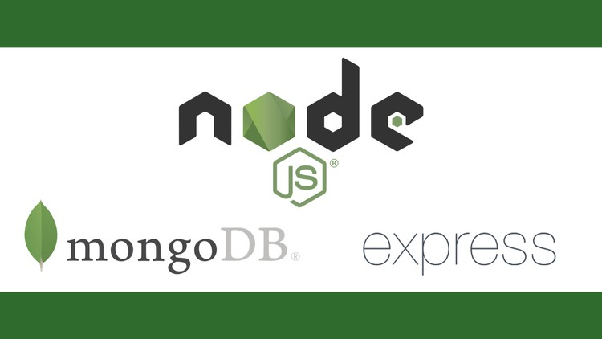

# LEARN NODE.JS WITH BLARD

Node.js is a powerful runtime environment that has gained immense popularity among developers for building server-side applications. In this article, we will explore Node.js from the ground up, covering essential concepts, code snippets, and best practices.




## What is Node.js?

Node.js is an open-source JavaScript runtime environment built on the V8 JavaScript engine by Google. Unlike traditional JavaScript, which runs in web browsers, Node.js allows JavaScript to be executed on the server-side(outside of the browser). Its non-blocking, event-driven architecture makes it an excellent choice for building fast and scalable applications.

Node.js is commonly used for web servers, APIs, real-time applications, and more. Let's dive into some fundamental aspects of Node.js.

## Running Node.js on the Terminal

Running Node.js applications is as simple as executing JavaScript files from the terminal. Here's how you can run a basic "Hello, World!" program:

```javascript
// hello.js
console.log("Hello, World!");
```

In the terminal:

```bash
node hello.js
```

This command will execute the `hello.js` file, and you will see "Hello, World!" printed to the terminal.

## Handling Modules in Node.js

Node.js leverages the CommonJS module system, allowing you to create reusable code modules. You can use `module.exports` to export a module and `require` to import it into other files.

**Example: Creating and using a module**

```javascript
// math.js
module.exports = {
  add: (a, b) => a + b,
  subtract: (a, b) => a - b,
};
```

```javascript
// main.js
const math = require('./math');

console.log(math.add(5, 3)); // Outputs: 8
console.log(math.subtract(10, 4)); // Outputs: 6
```

Node's module system makes it easy to organize and share code in your applications.

## Node Core Modules
Node.js provides several core modules that can be used to perform various tasks. Some common core modules include `os` for operating system information, `path` for file path operations, `fs` for file system operations, and `http` for creating HTTP servers.

## Using Core Modules: `os`, `path`, `fs`, and `http`

### Using the `os` Module:
The `os` module provides information about the operating system. Here's an example of how to use it:

```javascript
const os = require('os');

console.log('Operating System:', os.platform());
console.log('CPU Architecture:', os.arch());
console.log('Total Memory (bytes):', os.totalmem());
console.log('Free Memory (bytes):', os.freemem());
```

### Using the `path` Module:
The `path` module is useful for working with file paths. Here's an example:

```javascript
const path = require('path');

const filePath = path.join(__dirname, 'folder', 'file.txt');
console.log('File Path:', filePath);
```

### Using the `fs` Module:
The `fs` module allows you to interact with the file system. Here's an example of reading a file:

```javascript
const fs = require('fs');

fs.readFile('example.txt', 'utf8', (err, data) => {
  if (err) {
    console.error(err);
    return;
  }
  console.log('File Content:', data);
});
```


### HTTP Module
The 'http' module allows you to create HTTP servers and clients. Let's create a simple HTTP server:

```javascript
const http = require('http');

const server = http.createServer((req, res) => {
  res.writeHead(200, { 'Content-Type': 'text/plain' });
  res.end('Hello, HTTP server!');
});

const PORT = 3000;
server.listen(PORT, () => {
  console.log(`Server is running on port ${PORT}`);
});
```

By running this code, you'll start an HTTP server that listens on port 3000 and responds with "Hello, HTTP server!" when accessed through a web browser or API request.

## Installing Third-Party Modules with npm
Node.js uses npm (Node Package Manager) to manage packages and dependencies. You can install third-party modules easily:

```bash
npm install package-name
```

For example, to install the popular Express.js framework:

```bash
npm install express
```

You can then require and use it in your Node.js application.

## Error Handling in Node.js

Error handling is crucial in Node.js applications. We can use `try-catch` blocks or asynchronous error handling to manage exceptions effectively.

**Example: Asynchronous error handling with callbacks**

```javascript
const fs = require('fs');

fs.readFile('nonexistent-file.txt', (err, data) => {
  if (err) {
    console.error('An error occurred:', err.message);
    return;
  }
  console.log('File content:', data.toString());
});
```

## Building HTTP Server
Node.js excels at creating HTTP servers. You can build a server that handles various HTTP methods such as GET, POST, and DELETE. Here's a simplified example:

```javascript
const http = require('http');

const server = http.createServer((req, res) => {
  res.writeHead(200, { 'Content-Type': 'text/plain' });
  res.end('Hello, HTTP Server up and running!');
});

server.listen(3000, () => {
  console.log('Server is running on port 3000');
});
```


# Creating Express Server:
Express.js is a popular and minimalist web application framework for Node.js. In this module, we'll be looking at the process of setting up an Express server, explaining the recommended file structure, and configuring environment variables using a `.env` file.

Creating an Express server involves several steps. Let's go through them one by one:

**Step 1: Initialize Your Project**
To start, create a new directory for your project, navigate to it in the terminal, and run the following command to initialize your project:

```bash
npm init
```

This command will prompt you to provide information about your project, such as its name, version, description, entry point (usually `index.js`), and more. Once you've completed the prompts, it will generate a `package.json` file with your project's configuration.

**Step 2: Install Express**
Now that your project is initialized, you need to install Express as a dependency. Run the following command:

```bash
npm install express
```

This command will add Express to your project and update the `dependencies` section in your `package.json` file.

**Step 3: Create an Entry Point (index.js)**
Create an `index.js` file as the entry point for your Express application. This file will serve as the starting point for your server setup. You can also set up your Express app in this file.

**Step 4: Configure Your Express Application**
In your `index.js` file, import Express and configure your application. Here's a basic example of how to create an Express server:

```javascript
const express = require('express');
const app = express();
const port = process.env.PORT || 3000;

app.get('/', (req, res) => {
  res.send('Hello, Express running...');
});

app.listen(port, () => {
  console.log(`Server is running on port ${port}`);
});
```
**Step 5: Start Your Server**

Now you can start your Express server by running the following command:

```bash
node index.js
```
Your server should be up and running, and you can access it by navigating to `http://localhost:3000` in your web browser.


## Setting Up Environment Variables (.env File)

Environment variables are essential for configuring your application, and they should not be hard-coded in your source code. Create a `.env` file in the root directory of your project to store these variables.

**Step 1: Install dotenv**
To use environment variables from a `.env` file, install the `dotenv` package by running:

```bash
npm install dotenv
```

**Step 2: Configure Your `.env` File**
In your `.env` file, you can define environment-specific variables. For example:

```env
PORT=3000
DB_CONNECTION_URL=mongodb://localhost/mydb
SECRET_KEY=mysecret
```

**Step 3: Load Environment Variables**
In your `app.js` (or `index.js`), load the environment variables using `dotenv`:

```javascript
const dotenv = require('dotenv');
dotenv.config();
```

Now, you can access the environment variables anywhere in your application using `process.env`.

```javascript
const port = process.env.PORT || 3000;
const dbUrl = process.env.DB_URL;
const secretKey = process.env.SECRET_KEY;
```
This setup makes it easy to manage sensitive information and configuration options without exposing them in your codebase.


## File Structure Explained

A well-organized file structure is essential for maintaining a clean and scalable Express application. Here's a recommended structure:

- **`app.js`:** This is the main application file where you configure Express and set up middleware.

- **`index.js`:** The entry point of your application. It's responsible for starting the server.

- **`package.json`:** The project configuration file that includes information about your project and its dependencies.

- **`/src`:** This directory holds all your source code.

  - **`/auth`:** Contains files related to user authentication, such as login and registration.

  - **`/controllers`:** Controllers define the application's behavior.

  - **`/models`:** Models define your data schema and interact with your database.

  - **`/routes`:** This directory holds the route definitions for your application.

    - **`auth.js`:** Defines authentication-related routes.

    - **`api.js`:** Defines API endpoints.


## Separation of Routes, Controllers, and Middlewares
For more complex applications, you should separate your code into different files, such as routes, controllers, and middlewares. Express makes it easy to do this.

For more complex applications, you should separate your code into different files, such as routes, controllers, models, etc. Express makes it easy to do this.

 ## **Routes**
- Routes define the endpoints of our API and specify the HTTP methods (e.g., GET, POST) that can be used to access them.
e.g
- Blog routes:
GET /blog: Retrieve a list of all published posts
GET /blog/:post_id: Retrieve a single post by its ID

- Author routes: 
We want only authenticated users to have access to these routes and all of the CRUD operations.
GET /author/blog: Retrieve a list of all post published by a particular user.
POST /author/blog: Create a new post
PATCH /author/blog/edit/post_id: Update an post by its ID
PATCH /author/blog/edit/state/:post_id: Update an post's state
DELETE /author/blog/:post_id: Delete a post by its ID

- Auth routes: for managing user authentication.
POST /auth/signup: Register a new user
POST /auth/login: Log in an existing user

```javascript
// routes/users.js

const express = require('express');
const router = express.Router();
const userController = require('../controllers/userController');

// Define routes for user-related actions
router.post('/register', userController.register);
router.post('/login', userController.login);

module.exports = router;
```

In this example, we create routes for user registration and login, and we delegate the handling of these routes to the `userController`.

## **Controllers**
- Controllers contain the code for the controllers of our API. Controllers handle incoming requests and send responses to the client.
A controller is a function that is called when a route is matched, and it is responsible for handling the request and sending the response.

```javascript
// controllers/userController.js

const User = require('../models/User');

exports.register = async (req, res) => {
  // Logic for user registration
};

exports.login = async (req, res) => {
  // Logic for user login
};
```

Controllers receive the request from the router, interact with the Model (e.g., user registration or login), and send the appropriate response back to the client.

Middlewares are functions that can be inserted into the request-response cycle to perform tasks like authentication, validation, or logging. They can be applied globally or to specific routes.


## **Models** 
A data model is a representation of the data that will be stored in the database and the relationships between that data. We'll be using Mongoose to define our schema.

## Creating Models with Mongoose
If you're building a database-driven API, [Mongoose](https://mongoosejs.com/) is a popular library for working with MongoDB. You can define models and schemas for your data.

```javascript
// models/User.js

const mongoose = require('mongoose');

const userSchema = new mongoose.Schema({
  username: { type: String, required: true },
  email: { type: String, required: true, unique: true },
  password: { type: String, required: true },
});

module.exports = mongoose.model('User', userSchema);
```

Here, we define a user schema using Mongoose, a popular Object Data Modeling (ODM) library for MongoDB. The schema specifies the structure of a user document in the database.


## Connecting to a Database (MongoDB)
Connect your Node.js application to a MongoDB database using the Mongoose library. You'll need to set up a database, create a connection, and define models to interact with your data.
[MongoDB](https://www.cloud.mongodb.com/)

## Testing API Endpoints with Postman
[Postman](https://www.postman.com/) is a great tool for testing your API endpoints. It allows you to send HTTP requests to your server and inspect the responses.


## CRUD Operations Explained
CRUD (Create, Read, Update, Delete) operations are fundamental in API development. You'll need to implement these operations to interact with your data effectively.

## Basic Routes for CRUD Operations
In this section, we'll create a simple Express application with routes for basic CRUD (Create, Read, Update, Delete) operations on a list of items.

```javascript
const express = require('express');
const app = express();
const port = 3000;

// Sample data
let items = [
  { id: 1, name: 'Item 1' },
  { id: 2, name: 'Item 2' },
];

// Middleware to parse JSON requests
app.use(express.json());

// Create a new item
app.post('/items', (req, res) => {
  const newItem = req.body;
  items.push(newItem);
  res.status(201).json(newItem);
});

// Read all items
app.get('/items', (req, res) => {
  res.json(items);
});

// Read a specific item by ID
app.get('/items/:id', (req, res) => {
  const id = parseInt(req.params.id);
  const item = items.find((i) => i.id === id);
  if (item) {
    res.json(item);
  } else {
    res.status(404).send('Item not found');
  }
});

// Update an item by ID
app.put('/items/:id', (req, res) => {
  const id = parseInt(req.params.id);
  const updatedItem = req.body;
  const index = items.findIndex((i) => i.id === id);
  if (index !== -1) {
    items[index] = updatedItem;
    res.json(updatedItem);
  } else {
    res.status(404).send('Item not found');
  }
});

// Delete an item by ID
app.delete('/items/:id', (req, res) => {
  const id = parseInt(req.params.id);
  const index = items.findIndex((i) => i.id === id);
  if (index !== -1) {
    items.splice(index, 1);
    res.sendStatus(204);
  } else {
    res.status(404).send('Item not found');
  }
});

app.listen(port, () => {
  console.log(`Server is running on port ${port}`);
});
```
This Express application defines routes for creating, reading, updating, and deleting items. You can test these routes using a tool like Postman or by making HTTP requests in your browser.

## Commonly Used packages for building node api

- express
- dotenv
- nodemon
- mongoose
- cors
- express-fileupload
- express-validator
- body-parser
- bcrypt 
- jsonwebtoken(jwt)
- passport
- passport-jwt
- jest
- joi
- moment
- cloudinary
- helmet


1. **express**: Express is a web application framework for Node.js that simplifies the process of building robust web applications.

    - **Installation**:
      You can install Express using npm:
      ```bash
      npm install express
      ```

    - **Usage**:
      To create an Express application, you typically start with the following:

      ```javascript
      const express = require('express');
      const app = express();

      // Define your routes and middleware
      // ...

      // Start the Express server
      const port = process.env.PORT || 3000;
      app.listen(port, () => {
        console.log(`Server is running on port ${port}`);
      });
      ```

2. **dotenv**: Dotenv is a zero-dependency module that loads environment variables from a `.env` file into `process.env`.

    - **Installation**:
      Install dotenv using npm:
      ```bash
      npm install dotenv
      ```

    - **Usage**:
      Create a `.env` file in your project's root directory and add environment variables:

      ```
      DB_URI=your_mongodb_uri
      PORT=3000
      SECRET_KEY=your_secret_key
      ```

      Then, load the environment variables in your application:

      ```javascript
      require('dotenv').config();
      const port = process.env.PORT;
      const dbUri = process.env.DB_URI;
      const secretKey = process.env.SECRET_KEY;
      ```

3. **nodemon**: Nodemon is a utility that automatically restarts your Node.js application when source code changes are detected.

    - **Installation**:
      Install nodemon globally using npm:
      ```bash
      npm install -g nodemon
      ```

    - **Usage**:
      Instead of running your Node.js application with `node`, use `nodemon`:

      ```bash
      nodemon your_app.js
      ```

      Nodemon will monitor your files for changes and automatically restart the server.

4. **mongoose**: Mongoose is an ODM (Object Data Modeling) library for MongoDB that simplifies interactions with MongoDB.

    - **Installation**:
      Install mongoose using npm:
      ```bash
      npm install mongoose
      ```

    - **Usage**:
      Create a connection to MongoDB and define schemas and models for your data. Here's a simplified example:

      ```javascript
      const mongoose = require('mongoose');
      mongoose.connect(process.env.DB_URI, { useNewUrlParser: true, useUnifiedTopology: true });

      const userSchema = new mongoose.Schema({
        username: String,
        email: String,
        // ...
      });

      const User = mongoose.model('User', userSchema);
      ```

5. **cors**: The CORS (Cross-Origin Resource Sharing) package allows you to enable or configure CORS for your Express application.

    - **Installation**:
      Install cors using npm:
      ```bash
      npm install cors
      ```

    - **Usage**:
      Add CORS middleware to your Express app:

      ```javascript
      const cors = require('cors');
      app.use(cors());
      ```

6. **express-fileupload**: Express-fileupload is middleware for handling file uploads in Express applications.

    - **Installation**:
      Install express-fileupload using npm:
      ```bash
      npm install express-fileupload
      ```

    - **Usage**:
      Use express-fileupload as middleware to handle file uploads in your Express routes:

      ```javascript
      const fileUpload = require('express-fileupload');
      app.use(fileUpload());
      ```


7. **express-fileupload**: Express-fileupload is middleware for handling file uploads in Express applications.

   - **Installation**:
     Install express-fileupload using npm:
     ```bash
     npm install express-fileupload
     ```

   - **Usage**:
     Use express-fileupload as middleware to handle file uploads in your Express routes. Here's an example of handling file uploads and saving them:

     ```javascript
     const express = require('express');
     const fileUpload = require('express-fileupload');
     const app = express();

     // Middleware for handling file uploads
     app.use(fileUpload());

     app.post('/upload', (req, res) => {
       if (!req.files || Object.keys(req.files).length === 0) {
         return res.status(400).json({ message: 'No files were uploaded.' });
       }

       const uploadedFile = req.files.sampleFile;
       const uploadPath = __dirname + '/uploads/' + uploadedFile.name;

       uploadedFile.mv(uploadPath, (err) => {
         if (err) {
           return res.status(500).json({ message: 'File upload failed', error: err.message });
         }

         res.status(200).json({ message: 'File uploaded successfully' });
       });
     });

     // Start the Express server
     const port = process.env.PORT || 3000;
     app.listen(port, () => {
       console.log(`Server is running on port ${port}`);
     });
     ```

8. **express-validator**: This package is commonly used for input validation and sanitization in Express.js applications.

   - **Installation**:
     Install the package using npm:
     ```bash
     npm install express-validator
     ```

   - **Usage Example**:
     Here's a simplified example of how to use `express-validator` for input validation in an Express route handler:

     ```javascript
     const express = require('express');
     const { check, validationResult } = require('express-validator');

     const app = express();

     // Example route for user registration with input validation
     app.post('/register', [
       check('username').notEmpty().withMessage('Username is required'),
       check('email').isEmail().withMessage('Invalid email address'),
       check('password').isLength({ min: 6 }).withMessage('Password must be at least 6 characters long'),
     ], (req, res) => {
       // Handle the registration logic
       const errors = validationResult(req);

       if (!errors.isEmpty()) {
         return res.status(400).json({ errors: errors.array() });
       }

       // Registration code goes here
       res.status(201).json({ message: 'User registered successfully' });
     });

     // Start the Express server
     const PORT = process.env.PORT || 3000;
     app.listen(PORT, () => {
       console.log(`Server is running on port ${PORT}`);
     });
     ```

     In this example, we use `express-validator` to define validation rules for the username, email, and password fields in the registration route. If validation fails, it sends back an array of error messages as a response.

9. **body-parser**: Body-parser is a middleware for parsing request bodies in Express applications. Note that starting with Express 4.16.0, you don't need to use `body-parser` as a separate package; it's included with Express.

10. **bcrypt**: This package is commonly used for hashing and salting passwords for secure storage in a database.

   - **Installation**:
     Install the package using npm:
     ```bash
     npm install bcrypt
     ```

   - **Usage Example**:
     Here's an example of how to use `bcrypt` to hash a user's password before storing it in a database:

     ```javascript
     const bcrypt = require('bcrypt');
     const saltRounds = 10; // The number of salt rounds

     // Sample password to hash
     const passwordToHash = 'user_password';

     // Hash the password
     bcrypt.hash(passwordToHash, saltRounds, (err, hashedPassword) => {
       if (err) {
         console.error('Error hashing password:', err);
       } else {
         // Store the 'hashedPassword' in the database
         console.log('Hashed password:', hashedPassword);
       }
     });
     ```

     In this code, we use `bcrypt` to hash a user's password with a specified number of salt rounds. The resulting hash is then stored in the database.

11. **jsonwebtoken**: This package is commonly used for creating and verifying JSON Web Tokens (JWTs) for user authentication.

   - **Installation**:
     Install the package using npm:
     ```bash
     npm install jsonwebtoken
     ```

   - **Usage Example**:
     Here's a simplified example of how to use `jsonwebtoken` to create and verify JWTs for user authentication:

     ```javascript
     const jwt = require('jsonwebtoken');

     // Sample user data
     const user = { id: 123, username: 'example_user' };

     // Secret key for JWT
     const secretKey = 'your_secret_key';

     // Create a JWT
     const token = jwt.sign({ user }, secretKey, { expiresIn: '1h' });

     console.log('Generated JWT:', token);

     // Verify a JWT
     jwt.verify(token, secretKey, (err, decoded) => {
       if (err) {
         console.error('JWT verification failed:', err);
       } else {
         console.log('Decoded JWT data:', decoded);
       }
     });
     ```

     In this code, we use `jsonwebtoken` to create a JWT with a secret key and an expiration time. Later, we verify the JWT to ensure its authenticity and extract the user data from it.

These packages are commonly used in web applications to handle input validation, secure password storage, and implement user authentication and authorization.


12. **passport**: Passport is an authentication middleware for Node.js applications.

    - **Installation**:
      Install passport using npm:
      ```bash
      npm install passport
      ```

    - **Usage**:
      Passport provides a way to authenticate requests. Here's an example of how to set up Passport for local authentication:

      ```javascript
      const passport = require('passport');
      const LocalStrategy = require('passport-local').Strategy;

      // Configure Passport to use the local strategy
      passport.use(new LocalStrategy(
        (username, password, done) => {
          // Find and validate the user
          User.findOne({ username: username }, (err, user) => {
            if (err) {
              return done(err);
            }
            if (!user) {
              return done(null, false, { message: 'Incorrect username' });
            }
            if (!user.validatePassword(password)) {
              return done(null, false, { message: 'Incorrect password' });
            }
            return done(null, user);
          });
        }
      ));

      // Serialize and deserialize user
      passport.serializeUser((user, done) => {
        done(null, user.id);
      });

      passport.deserializeUser((id, done) => {
        User.findById(id, (err, user) => {
          done(err, user);
        });
      });
      ```

      You also need to initialize Passport and use it as middleware in your Express application. Passport allows you to implement various authentication strategies, including local, OAuth, and more.

13. **passport-jwt**: Passport-JWT is an extension of the Passport authentication middleware for handling JSON Web Tokens (JWT) authentication strategies.

    - **Installation**:
      Install passport-jwt using npm:
      ```bash
      npm install passport-jwt
      ```

    - **Usage**:
      Passport-JWT allows you to authenticate requests using JWTs. Here's an example of how to set up Passport-JWT for token-based authentication:

      ```javascript
      const passport = require('passport');
      const JwtStrategy = require('passport-jwt').Strategy;
      const ExtractJwt = require('passport-jwt').ExtractJwt;

      const opts = {
        jwtFromRequest: ExtractJwt.fromAuthHeaderAsBearerToken(),
        secretOrKey: 'your_secret_key',
      };

      passport.use(new JwtStrategy(opts, (jwt_payload, done) => {
        User.findById(jwt_payload.sub, (err, user) => {
          if (err) {
            return done(err, false);
          }
          if (user) {
            return done(null, user);
          } else {
            return done(null, false);
          }
        });
      }));
      ```

      This example sets up a Passport-JWT strategy for verifying JWTs in bearer tokens. You can use this strategy in your routes to protect them with JWT authentication.

14. **jest**: Jest is a popular JavaScript testing framework for Node.js applications.

    - **Installation**:
      Install Jest using npm:
      ```bash
      npm install jest --save-dev
      ```

    - **Usage**:
      Create test files with the `.test.js` extension or use the `.test.js` suffix within your test files. Here's an example of a simple test:

      ```javascript
      // myModule.js
      function add(a, b) {
        return a + b;
      }

      module.exports = { add };

      // myModule.test.js
      const { add } = require('./myModule');

      test('add function should add two numbers correctly', () => {
        expect(add(2, 3)).toBe(5);
        expect(add(-1, 1)).toBe(0);
      });
      ```

      You can run your tests using the `jest` command. Jest will automatically discover and run your test files.

15. **joi**: Joi is a powerful schema description language and data validator for JavaScript. It's often used for validating and sanitizing user input.

    - **Installation**:
      Install Joi using npm:
      ```bash
      npm install joi
      ```

    - **Usage**:
      Define schemas and use Joi to validate input data. Here's an example:

      ```javascript
      const Joi = require('joi');

      const userSchema = Joi.object({
        username: Joi.string().alphanum().min(3).max(30).required(),
        email: Joi.string().email().required(),
        password: Joi.string().pattern(new RegExp('^[a-zA-Z0-9]{3,30}$')),
      });

      const userInput = {
        username: 'john_doe',
        email: 'john.doe@example.com',
        password: 'secretpassword',
      };

      const { error, value } = userSchema.validate(userInput);

      if (error) {
        console.error('Validation error:', error.details);
      } else {
        console.log('Valid user data:', value);
      }
      ```

16. **moment**: Moment.js is a popular library for parsing, formatting, and manipulating dates and times in JavaScript.

    - **Installation**:
      Install Moment.js using npm:
      ```bash
      npm install moment
      ```

    - **Usage**:
      You can use Moment.js for various date and time-related operations. Here's an example:

      ```javascript
      const moment = require('moment');

      // Current date and time
      const now = moment();

      // Format a date
      console.log(now.format('YYYY-MM-DD HH:mm:ss'));

      // Add days to a date
      const futureDate = now.add(7, 'days');
      console.log(futureDate.format('YYYY-MM-DD'));

      // Calculate the difference in days between two dates
      const startDate = moment('2023-09-15');
      const endDate = moment('2023-09-22');
      const daysDiff = endDate.diff(startDate, 'days');
      console.log(`Days difference: ${daysDiff}`);
      ```

17. **cloudinary**: Cloudinary is a cloud-based service for managing and delivering media assets. It's often used for image and video upload, storage, and manipulation.

    - **Installation**:
      Install the Cloudinary package using npm:
      ```bash
      npm install cloudinary
      ```

    - **Usage**:
      To use Cloudinary in your application, you need to sign up for a Cloudinary account and obtain your API credentials. Here's a basic example of how to upload an image to Cloudinary:

      ```javascript
      const cloudinary = require('cloudinary').v2;

      // Configure Cloudinary with your API credentials
      cloudinary


18. **helmet**: Helmet is a package that helps secure your Express.js applications by setting various HTTP headers.

   - **Installation**:
     Install helmet using npm:
     ```bash
     npm install helmet
     ```

   - **Usage**:
     Helmet provides various middleware functions to set HTTP security headers in your Express application. Here's an example:

     ```javascript
     const express = require('express');
     const helmet = require('helmet');
     const app = express();

     // Use helmet middleware to set various security headers
     app.use(helmet());

     // Additional security configurations
     app.use(helmet.contentSecurityPolicy());
     app.use(helmet.referrerPolicy({ policy: 'same-origin' }));

     // Define your routes and middleware
     // ...

     // Start the Express server
     const port = process.env.PORT || 3000;
     app.listen(port, () => {
       console.log(`Server is running on port ${port}`);
     });
     ```

     Helmet sets security-related HTTP headers, such as content security policies, referrer policies, and more, to enhance the security of your Express application. It's important for protecting your application from common web vulnerabilities.


**NB: This repo will be updated periodically @BLARD_DEV 2023** 
